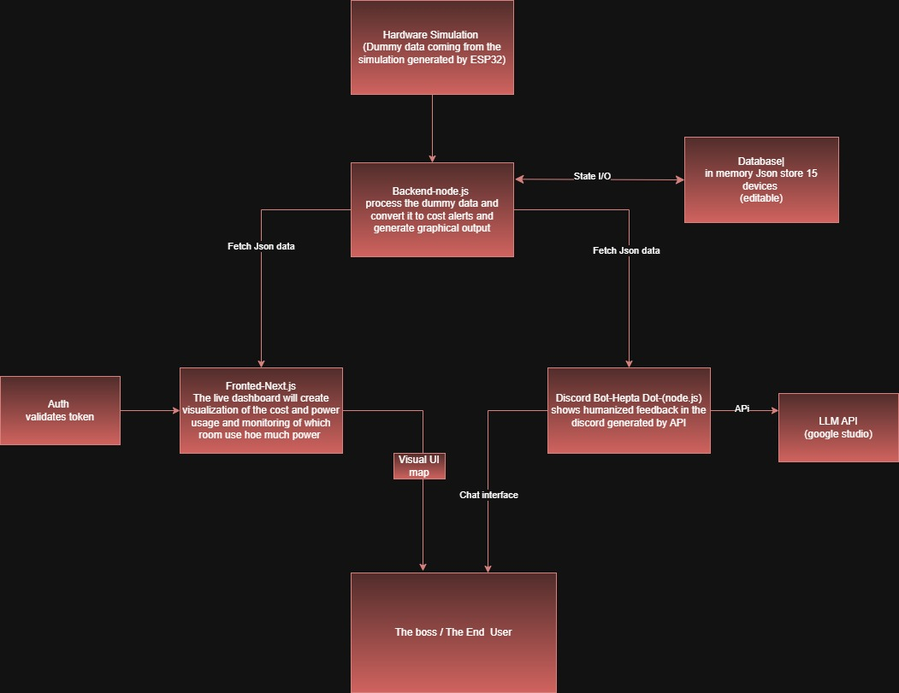
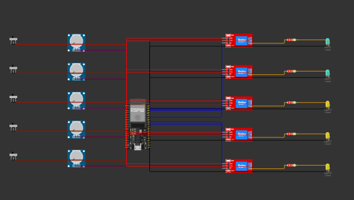

# OfficePulse AI

**AI + IoT office electricity monitoring with real-time analytics, cost tracking, alerts, an editable floor visualizer, and a humanized Discord assistant.**

OfficePulse AI turns device-level electrical telemetry into a clear operational view for office owners. ESP32 room nodes, or the included simulator, report fan and light measurements to one backend. The backend validates and stores telemetry, calculates energy and BDT cost, detects waste and faults, and supplies the web dashboard and Discord bot with the same trusted data.

## What Judges Should See

- **Real hardware path:** the simulator and a physical ESP32 use the same versioned telemetry contract and backend endpoint.
- **One source of truth:** timing, kWh, cost, alert rules, room totals, and office totals are calculated by the backend, never guessed by the UI or bot.
- **Dynamic discovery:** previously unknown ESP32 nodes and devices are discovered automatically and can be assigned, unassigned, ignored, archived, or re-assigned.
- **Live experience:** Socket.IO updates the dashboard and Discord alerts while polling provides a fallback.
- **Operational intelligence:** office-time and off-time energy are separated, monthly estimates are backend-calculated, and abnormal states produce configurable alerts.
- **AI with guardrails:** Gemini Flash humanizes Discord responses using backend data only, with a polished rule-based fallback.
- **Required commands:** `!status`, `!room <name>`, and `!usage` are primary, humanized bot commands.
- **Editable office map:** the top-down visualizer supports dynamic rooms and devices and stores user-defined positions in MongoDB.
- **Traceability:** raw telemetry, sequence decisions, usage intervals, alert occurrences, node/device history, and audit events are persisted.

## System Design



> The supplied diagram is the original design reference. The implemented backend uses **MongoDB with Mongoose**, rather than the early in-memory JSON store shown in the image.

### Implemented Data Flow

1. A simulator or physical ESP32 sends room-node telemetry to `POST /api/iot/telemetry`.
2. The Express backend validates the device API key, schema version, sequence, event type, and measurements.
3. MongoDB stores discovery records, latest state, raw telemetry, usage intervals, alerts, settings, history, audit logs, and visualizer positions.
4. The backend calculates power, kWh, BDT cost, office/off-time usage, monthly estimates, and alert conditions.
5. The Next.js dashboard reads REST APIs and subscribes to Socket.IO events.
6. The Discord bot reads the same backend APIs, receives proactive alerts, and asks Gemini Flash to humanize verified backend facts.

The frontend and bot never read simulator internals.

## Electrical Schematic



The schematic represents an ESP32 room controller connected to five monitored loads: two fans and three lights. The current simulator models the same per-room device arrangement and can be replaced by real ESP32 firmware that sends the documented telemetry payload.

## Technology

| Layer | Language and tools | Responsibility |
| --- | --- | --- |
| Backend | Node.js, TypeScript, Express, Mongoose, Zod, Socket.IO | Telemetry ingestion, state, calculations, alerts, APIs, realtime events |
| Frontend | TypeScript, React 19, Next.js 15, Tailwind CSS, Recharts | Responsive dashboard, costs, alerts, device management, visualizer |
| Database | MongoDB / MongoDB Atlas | Operational state, telemetry, energy intervals, alerts, history, layout |
| Simulator | Node.js, TypeScript, HTML, CSS, JavaScript | Three fake ESP32 room nodes and a browser control center |
| Discord bot | Node.js, TypeScript, discord.js, `@google/genai` | Commands, proactive alerts, Gemini-humanized backend data |
| Validation | Zod and Mongoose schemas | Strict telemetry and management contracts |

## Project Modules

```text
.
|-- backend/       Express API, MongoDB models, calculations, alerts, Socket.IO
|-- frontend/      Next.js dashboard and editable office visualizer
|-- simulator/     Fake ESP32 nodes and simulator control UI
|-- discord-bot/   Discord commands, alerts, and Gemini humanization
|-- docs/          API, database, telemetry, diagrams, and Word project guide
`-- scripts/       Local multi-service development launcher
```

## Main Capabilities

**Dashboard**

- Current load, daily/monthly energy and BDT cost, room cost breakdowns, and usage timelines
- Live devices and node health with pending-node connection workflows
- Cost calculator and office-time versus off-time waste visibility
- Filtered notification list, unread badges, toast alerts, and browser notifications
- Dynamic top-down visualizer with doors, windows, furniture, live devices, zoom, edit mode, and MongoDB persistence

**Backend**

- Strict telemetry `1.0` validation and `x-device-api-key` authentication
- Dynamic node/device discovery and one-node-per-room assignment protection
- Duplicate and old sequence isolation without corrupting live state or usage
- Backend-owned timestamps, on-duration, energy integration, BDT cost, monthly estimates, and scoped alerts
- REST API, Socket.IO events, rate limiting, CORS, Helmet, audit logs, and graceful shutdown

**Simulator**

- Three room nodes, five devices per room, and 15 devices total
- Manual and automatic modes, heartbeats, boot snapshots, custom wattage, and measurement profiles
- Browser control center at `http://localhost:5100`
- Parallel telemetry delivery using the same contract expected from physical ESP32 nodes

**Discord Bot**

- Slash and prefix commands backed by live server data
- Primary hackathon commands: `!status`, `!room <name>`, and `!usage`
- Backend-powered room/device lookup and autocomplete
- Gemini Flash humanization with strict fact-only prompts and rule-based fallback
- Socket.IO proactive alerts with polling fallback

## Local Setup

### Prerequisites

- Node.js 20 or newer
- npm
- MongoDB Community Server running locally, or a MongoDB Atlas connection string
- A Discord application/token for the bot
- A Google AI Studio API key for Gemini humanization

### 1. Install Dependencies

From the repository root:

```bash
npm install
```

### 2. Create Environment Files

```bash
cp backend/.env.example backend/.env
cp frontend/.env.example frontend/.env.local
cp simulator/.env.example simulator/.env
cp discord-bot/.env.example discord-bot/.env
```

Use the same private `DEVICE_API_KEY` in `backend/.env` and `simulator/.env`.

### 3. Start MongoDB and Seed Defaults

For local MongoDB, keep:

```text
MONGODB_URI=mongodb://127.0.0.1:27017/officepulse
```

Then initialize default settings:

```bash
npm run seed
```

### 4. Run the Services

Open separate terminals from the repository root:

```bash
npm run dev:backend
npm run dev:frontend
npm run dev:simulator
npm run dev:discord-bot
```

Register Discord slash commands once after configuring the bot:

```bash
npm run commands:register -w discord-bot
```

Local URLs:

| Service | URL |
| --- | --- |
| Dashboard | `http://localhost:3000` |
| Backend health | `http://localhost:4000/health` |
| Simulator control center | `http://localhost:5100` |

`npm run dev` starts the backend and frontend together. The simulator and Discord bot remain separate processes.

### Build and Test

```bash
npm run build
npm test -w backend
npm test -w simulator
npm test -w discord-bot
```

## Environment Variables

### Backend

| Variable | Production value |
| --- | --- |
| `MONGODB_URI` | MongoDB Atlas `mongodb+srv://.../officepulse?...` URI |
| `PORT` | Provided by the hosting platform |
| `DEVICE_API_KEY` | Strong shared secret used by backend and ESP32/simulator |
| `CORS_ORIGIN` | Exact deployed frontend origin |
| `DEFAULT_TIMEZONE` | `Asia/Dhaka` or the office timezone |
| `DEFAULT_BDT_PER_KWH` | Electricity tariff, for example `12` |
| `DEFAULT_OFFICE_START_TIME` | `HH:mm`, for example `09:00` |
| `DEFAULT_OFFICE_END_TIME` | `HH:mm`, for example `18:00` |
| `DEFAULT_ALERT_REPEAT_MINUTES` | Positive integer |
| `HEARTBEAT_TIMEOUT_SECONDS` | Positive integer |

### Frontend

| Variable | Production value |
| --- | --- |
| `NEXT_PUBLIC_BACKEND_URL` | Public HTTPS backend URL without a trailing slash |

### Simulator

| Variable | Production value |
| --- | --- |
| `BACKEND_URL` | Public HTTPS backend URL |
| `IOT_TELEMETRY_PATH` | `/api/iot/telemetry` |
| `DEVICE_API_KEY` | Exactly the same secret as backend `DEVICE_API_KEY` |
| `SIMULATOR_CONTROL_PORT` | Listening port; use `10000` on Render |
| `TICK_INTERVAL_MS` | Automatic-mode update interval |
| `HEARTBEAT_INTERVAL_MS` | Heartbeat interval |
| `AUTO_START` | `true` or `false` |
| `DRY_RUN` | `false` in production |
| `TIMEZONE` | Simulator display timezone |
| `LOG_LEVEL` | `debug`, `info`, `warn`, or `error` |

### Discord Bot

| Variable | Purpose |
| --- | --- |
| `DISCORD_BOT_TOKEN` | Discord bot token |
| `DISCORD_CLIENT_ID` | Discord application ID |
| `DISCORD_GUILD_ID` | Development server ID; optional for global commands |
| `BACKEND_URL` | Public HTTPS backend URL |
| `BACKEND_API_KEY` | Optional; currently blank because read APIs are public |
| `GEMINI_API_KEY` | Google AI Studio key |
| `GEMINI_MODEL` | `gemini-flash-latest` |
| `ALERT_CHANNEL_ID` | Default Discord alert channel |
| `ENABLE_PREFIX_COMMANDS` | Enable `!` commands |
| `ENABLE_SLASH_COMMANDS` | Enable slash commands |
| `ENABLE_PROACTIVE_ALERTS` | Enable backend-driven alerts |
| `ENABLE_AI_HUMANIZATION` | Enable Gemini humanization |
| `AI_FALLBACK_TO_RULE_BASED` | Keep replies available if Gemini fails |
| `ALERT_POLL_INTERVAL_SECONDS` | Alert polling fallback interval |
| `BACKEND_TIMEOUT_MS` | Backend request timeout |
| `COMMAND_COOLDOWN_SECONDS` | Per-command cooldown |
| `AI_COOLDOWN_SECONDS` | Gemini cooldown |
| `BACKEND_CACHE_SECONDS` | Bot-side read cache duration |
| `LOG_LEVEL` | `debug`, `info`, `warn`, or `error` |

Never commit `.env` files, Discord tokens, Gemini keys, or device API keys.

## Production Deployment

The recommended deployment uses **four independent services** because the backend, simulator, frontend, and bot have different lifecycles.

### 1. MongoDB Atlas

1. Create an Atlas cluster and database user.
2. Configure Network Access for the hosting services.
3. Copy the application connection string and include the database name.
4. Set that URI as backend `MONGODB_URI`.

Prefer an SRV URI and make sure query parameters are separated with `&`, not a second `?`.

### 2. Backend on Render

Create a Node web service:

```text
Root Directory: backend
Build Command: npm install && npm run build
Start Command: npm start
Health Check Path: /health
```

Add the backend variables listed above. Set `CORS_ORIGIN` to the final Vercel frontend URL. The service must return `2xx` from `/health`.

### 3. Simulator on Render

Create a second Node web service:

```text
Root Directory: simulator
Build Command: npm install && npm run build
Start Command: npm start
Health Check Path: /health
```

Set `BACKEND_URL`, the shared `DEVICE_API_KEY`, `DRY_RUN=false`, and `SIMULATOR_CONTROL_PORT=10000`.

The simulator and backend should be **two Render services**. Each is a long-running HTTP process with its own port, health check, logs, and restart lifecycle.

### 4. Frontend on Vercel

Import the repository as a Vercel project:

```text
Framework: Next.js
Root Directory: frontend
Environment: NEXT_PUBLIC_BACKEND_URL=https://your-backend.onrender.com
```

CLI deployment:

```bash
cd frontend
npx vercel link
npx vercel env add NEXT_PUBLIC_BACKEND_URL production
npx vercel --prod
```

After the Vercel URL is known, update backend `CORS_ORIGIN` and redeploy the backend.

### 5. Discord Bot on Railway

Create a persistent Railway service:

```text
Root Directory: /discord-bot
Build Command: npm install && npm run build
Start Command: npm start
```

Add the Discord, backend, Gemini, alert, and behavior variables from `discord-bot/.env.example`. The bot does not need a public domain. Register slash commands after setting the variables:

```bash
npm run commands:register
```

## Documentation

- [Database schema](docs/database-schema.md)
- [REST and realtime API schema](docs/api-schema.md)
- [ESP32 telemetry contract](docs/telemetry-contract.md)
- [Project guide with diagrams](docs/OfficePulse-AI-Project-Guide.docx)

## Security Notes

- Telemetry writes require `x-device-api-key`.
- Public dashboard read/management APIs currently rely on CORS and deployment controls; add user authentication before an internet-facing multi-user rollout.
- Helmet, request size limits, rate limiting, strict schema validation, and secret-only environment files are enabled.
- Rotate any credential that has been shared outside its intended secret store.

## Deployment References

- [Render monorepo services](https://render.com/docs/monorepo-support)
- [Render health checks](https://render.com/docs/health-checks)
- [Vercel monorepo deployment](https://vercel.com/kb/guide/deploying-yarn-monorepos-to-vercel)
- [Railway monorepo deployment](https://docs.railway.com/deployments/monorepo)
- [MongoDB Atlas connection strings](https://www.mongodb.com/docs/manual/reference/connection-string/)

## License

See [LICENSE](LICENSE).
